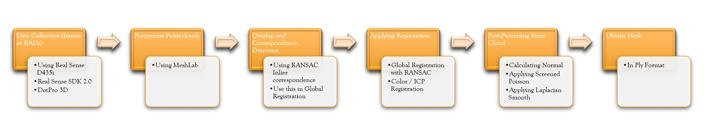
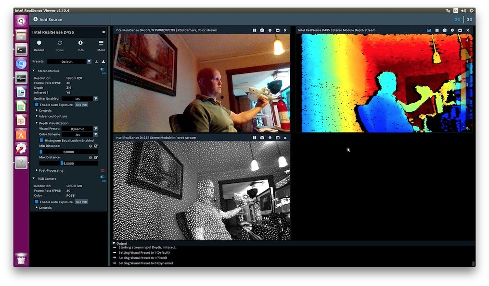

# Synthetic Human Generation for Pose Data Augmentation

This repository is part of Masters thesis by [Kathan Vyas](vyas.k@northeastern.edu) and was developed at the [Augmented Cognition Lab](https://web.northeastern.edu/ostadabbas/). 


The given pipeline can use point clouds scanned using any depth camera (recomended: Intel RealSense D435i) and implement two different variants of Iterative Closest Point (ICP) based on availability of color information for the point clouds. The whole process is displayed in figure below.



## Contact: 
[Kathan Vyas](vyas.k@northeastern.edu)

[Sarah Ostadabbas](ostadabbas@ece.neu.edu)


## Table of content

- [Data collection Process](##data-collection-process)
    - [Hardware](###hardware)
    - [Setup](###Exraction-setup)
- [Installation](##Installation)
- [Usage](##Usage)
    - [Execution](###Execution)
    - [Code Explanation](###code) 
- [Results](##Result)
    - [Output](###Output)
- [Post Processing](##Post-Processing)
- [Citation](##Citation)
- [License](##license)
- [Acknowledgements](##Acknowledgements)
- [Contact](##Contact) 
- [References](##References) 

## Data Collection Process

For the purpose of this project, collect data for point clouds or scans from a depth camera. The main algorithm accepts point clouds in either .pcd or .ply format and it can accept any number of point clouds from 2 to 5000. The numbers of point clouds (scans) is something that depends on requirement of the final registered point cloud resolution.

### Hardware

In our experiments while creating the pipeline, we used [Intel RealSense D435i](https://www.intelrealsense.com/) which is a depth sensing camera from Intel. The Intel RealSense™ D4xx depth cameras can stream live depth (i.e. ranging data) and color data at up to 90 frames per second, and all the processing to generate the depth data is done on-board by the embedded D4 application-specific integrated circuits (ASIC). All the Intel RealSense cameras can be connected to the machine using an USB-C type cable and could be operated using dedicated [RealSense SDK](https://www.intelrealsense.com/sdk-2/). The sdk is only available for windows 10. The sdk can be used to capture a point cloud or record a sequence of point cloud with a file with extension ".bag". 

### Exraction-setup

The subject that is being scanned is to be kept in front of camera. You can use a rotating table on which you can put the subject and rotate it. You can then use the RealSense SDK-viewer API which is as shown in figure here.




There are two ways the data collection can be done. 

1. Capture individual point clouds from various angles. You can select specific angles around the subject, for instance capture a point cloud at every 60 degrees around the subject, so a total of 6 point clouds would cover 360 degrees around the body. If you plan to capture every 45 degrees, you will be able to capture 8 point clouds and so on. Please make sure you cover the subject from sides and angles. Please save the names of point clouds starting from 0. 

2. Record a "BAG" file which is nothing but a collection of continuously recorded point clouds. A "BAG" file can be recorded using the Intel RealSense SDK viewer app. You can record the file within a set frames per second (FPS). This FPS is important because later on when you extract frames from the "BAG" file, the number of frames extracted will be equal to fps*seconds_of_recorded_file . Once we have a "BAG" file, you can use the Intel RealSense API module [rs-convert] (https://github.com/IntelRealSense/librealsense/tree/master/tools/convert). The rs-convert is a console app for converting bag files to various formats (currently supported: PNG, RAW, CSV, PLY, BIN). In our case we can convert the frames to .ply or .pcd. The code to extract a  10 second "file.bag" which was recorded on 30fps will produce 300 frames using following code:


```
cd path_to_ Intel RealSense SDK 2.0/tools
.\rs-convert.exe -l path_of_output_folder -i file.bag
```

Please save the point clouds starting from 0 to n point clouds. The structure of the saved point clouds should be saved as:


```
folder
    -0.pcd
    -1.pcd
     .
     .
     .
     .
    -n.pcd
```

## Installation

The algorithm is purely working in python 3.6 or higher. The requirement of the algorithm needs some libraries which can be installed using the ''requirement.txt'' file. 
Please make an enviornment using this requirement file and your are ready to go. If you have issues with numpy and open3D, please install numpy firls either using whl or source 
and then install open3D.

## Usage

The code is very self-explanatory and easy to use. There are two main files:

1. General_ICP.ipynb     -> Used if color information is not available
2. Color_ICP.ipynb       -> Used if color information is available

### Execution

The execution of each code asks for following argument:

1. Number of point clouds: This is the total number of point cloud you are using as input. this number as explained earlier can be anywhere between 2 to n.

2. Input Folder (not asked in this version but will be put as an argument in later version): This is not asked as argument. you can change the directory for the input from each of the file.

3. Output Folder (not asked in this version but will be put as an argument in later version): This is where the output registered point cloud will be stored. Present version stores a final registered point cloud in same directory as input directory.

### Code

This section will look into parts of code responsible for operation of registration. It explains all functions used in the code 

1. For General_ICP.ipynb

These functions are responsible for import of the point clouds. The "load_point_clouds" takes in the input directory, voxel size (one of the hyper-parameters set by user), number of point clouds in the input directory and the angles (if known). The "preprocess_point_cloud" takes in each point cloud from the input directory and calculates global geometric features "Fast Point Feature Histogram" as well as "Normals" for each point in the point cloud. More details about this could be obtained from the [paper](https://web.northeastern.edu/ostadabbas/) in subsequent sections.
```
def load_point_clouds(directory ,voxel_size ,n,g)

def preprocess_point_cloud(pcd, voxel_size)   
```

The "execute_global_registration" implements the RANSAC based global registration. It uses the the calculated geometric features along with pairs of point clouds (source and target) to obtain initial allignment with a RANSAC based inler identification technique. The outpus of this function will be initial alignment for the source and target. The function "pairwise_registration" applies the general ICP algorithm using the inital alignment obtained from global_registration function. It will return the final transformation matrix (includes rotation and translation between source and target). The "main_registration" then implements pose graph to obtained a collective registration of all input point cloud to give one single registered point cloud. The "final_fun" is just a collection of these previously defined functions in one single function.
```
def execute_global_registration(source_down, target_down, source_fpfh, target_fpfh, voxel_size)

def pairwise_registration(source, target, source_fpfh, target_fpfh, voxel_size)

def main_registration(pcds,fpfh, max_correspondence_dist_coarse,max_correspondence_dist_fine, voxel_size)

def final_fun(dirtry, g)
```

The "draw_registration_result" allows visualization of the point clouds. It can implement transformation to a point cloud. This function can be used to visualise two point clouds with a without trnsformation applied.

```
def draw_registration_result(source, target, transformation)
```


## Result

The result of the whole process is a final registered point cloid. If you have not made any changes in teh directory of the output file, the final file will be saved in teh same directory as input files. You can change the extension of the output file to either ".ply" or ".pcd" formats. Open3D library is needed for this.The resulting point cloud can be viewed using following code:

```
import open3d as o3d

pcd = o3d.io.read_point_cloud("../point_cloud.ply")    #point cloud directory                                           #
print(np.asarray(pcd.points))                          #print X-Y-Z coordintaes of the points
o3d.visualization.draw_geometries([pcd])               #Draw_geometries helps to visualise the point cloud. 
```

Or it can also be viewed using either online version of [meshlab-online](http://www.meshlabjs.net/) or you can download [meshlab on local machine](https://www.meshlab.net/#download). For more detail on how to import a point cloud in meshlab please look at the instructions found [here](http://www.heritagedoc.pt/doc/Meshlab_Tutorial_iitd.pdf)


## License 
* This code is for non-commertial purpose only. For other uses please contact ACLab of NEU. 
* No maintainence service 

## Acknowledgements ###

The whole pipeline code is influenced using the code from [open3D](http://www.open3d.org/) library. Also the research papers used for the construction are provided in reference section.


## References

1. M. A. Fischler and R. C. Bolles, “Random sample consensus: a paradigm for model fittingwith applications to image analysis and automated cartography,”Communications of the    ACM,vol. 24, no. 6, pp. 381–395, 1981
2. S. Rusinkiewicz and M. Levoy, “Efficient variants of the icp algorithm,” inProceedings thirdinternational conference on 3-D digital imaging and modeling.    IEEE, 2001, pp.    145–152
3. Y. Chen and G. Medioni, “Object modelling by registration of multiple range images,”Imageand vision computing, vol. 10, no. 3, pp. 145–155, 1992
4. J. Park, Q.-Y. Zhou, and V. Koltun, “Colored point cloud registration revisited,” inProceedingsof the IEEE International Conference on Computer Vision, 2017, pp. 143–152
